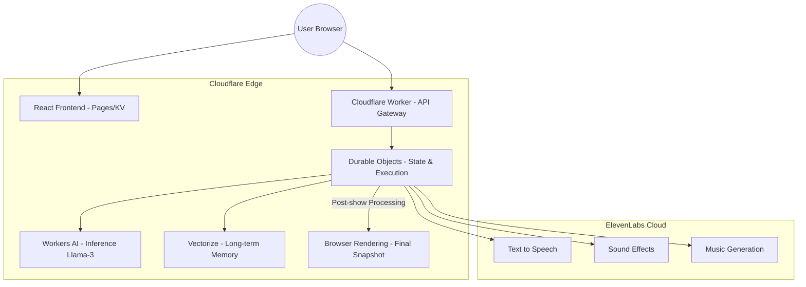

# Microwave Show 🍿

[](https://workers.cloudflare.com/)
[](https://elevenlabs.io/)
[](https://reactjs.org/)

Microwave Show is a creative AI-agent application that transforms boring microwave wait times into a high-stakes, narrated cinematic experience. Built for the **Cloudflare x ElevenLabs Hackathon**, it pushes the boundaries of edge computing by integrating stateful AI agents, long-term memory, and real-time audio orchestration.

---

## 🏗 System Architecture (Cloudflare Agents)

Below is the high-level infrastructure showing how we utilize the full power of the Cloudflare Developer Platform integrated with ElevenLabs APIs.



---

## 🌟 Key Features & Implementation

### 1. Durable Execution (Durable Objects)
We use **Cloudflare Durable Objects** to manage the state of each "Microwave Show". Unlike stateless workers, our DOs maintain the countdown timer, the narration history, and phase transitions. This ensures a consistent, authoritative experience even if the user refreshes their browser.

### 2. Serverless Inference (Workers AI)
Narrations are generated on-the-fly using **Workers AI (Meta Llama-3)**. The agent understands the "style" selected by the user (Sports, Horror, Anime, etc.) and crafts dramatic scripts that fit perfectly into the remaining time.

### 3. Long-term Memory (Vectorize)
The agent doesn't just forget. After every show, the result is embedded and stored in **Cloudflare Vectorize**. When you cook the same dish again, the agent recalls your history ("The last time we cooked this Pizza, it was legendary!") providing a personalized, persistent narrative across sessions.

### 4. Cinematic Audio (ElevenLabs APIs)
The show comes to life with **ElevenLabs**:
- **TTS**: High-fidelity voices tailored to the show's style.
- **Sound Generation**: Dynamic SFX generated based on the AI's description of the dish.
- **Music**: Thematic background scores that escalate in intensity as the timer hits zero.

### 5. SLO & Cost Control
Built with production limits in mind. We've implemented a **Durable Budgeting System** ($0.05 per session) within the Durable Object. It tracks API usage and token counts, enforcing service level objectives and preventing cost overruns while maintaining high availability through local fallbacks.

---

## 🛠 Setup & Installation

### Prerequisites
- Node.js 18+
- Cloudflare Account with Workers, Durable Objects, and Vectorize enabled.
- ElevenLabs API Key.

### 1. Backend (Cloudflare Worker)
```bash
cd worker
npm install
npx wrangler secret put ELEVENLABS_API_KEY
# If using Gemini
npx wrangler secret put GEMINI_API_KEY

# Initialize Vectorize Index
npx wrangler vectorize create microwave-memory --dimensions=3 --metric=cosine

# Deploy
npx wrangler deploy
```

### 2. Frontend (Vite + React)
```bash
npm install
cp .env.example .env
# Update VITE_API_BASE to your deployed worker URL
npm run dev
```

---

## 🇯🇵 日本語概要

Microwave Show は、電子レンジの「ただ待つだけの時間」を、AIが実況するドラマチックなエンターテインメントへと変貌させるアプリケーションです。Cloudflare のエッジコンピューティングと ElevenLabs の音声合成技術を極限まで活用した、全く新しい「AIエージェント」体験を提供します。

### 技術の核心
- **Durable Execution**: Durable Objects を使用し、リクエストを跨いで実況の状態、履歴、タイマーをエッジ上で「永続的」に稼働させます。
- **Memory (Vectorize)**: 過去に作った料理や実況の内容を Vectorize が記憶しており、次回の実況に「前回の続き」としてのコンテキストを反映させます。
- **Inference (Workers AI)**: Llama 3 をエッジで実行し、スタイルに応じたナレーションをリアルタイムに生成します。
- **Cost & SLO Control**: 1セッションあたり5セントという予算制限を Durable Object 内で監視・強制し、コスト効率と安定性を両立しています。

Cloudflare のインフラをフル活用することで、状態を持ち、記憶を持ち、自律的に演出を行う「真のAIエージェント」を実現しました。

---

## 🛡 Security & SLO
- **Strict Content Security Policy (CSP)** enforced at the edge.
- **Automatic Fallback**: If backend APIs fail, the system falls back to High-Quality Local Synthesis (SpeechSynthesis API) to ensure the timer never breaks.
- **Budget Tracking**: Real-time USD cost calculation per show.

---

*Built with ❤️ for the ElevenLabs x Cloudflare Hackathon 2026.*
