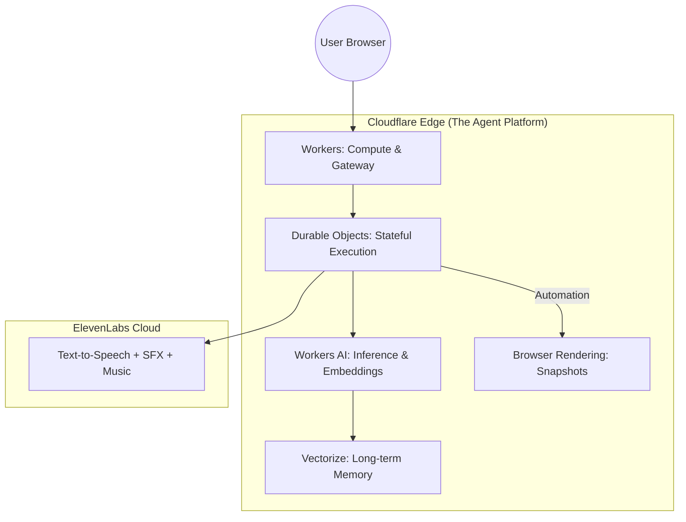

# Microwave Show 🍿: Cinematic AI Agent on Cloudflare

[](https://workers.cloudflare.com/)
[](https://elevenlabs.io/)
[](https://reactjs.org/)

**Microwave Show** is a stateful, cinematic AI agent that recovers "Dead Time"—the boring gap while waiting for a microwave—and transforms it into high-fidelity entertainment. Built for the **Cloudflare x ElevenLabs Hackathon**, it demonstrates the full power of the **Cloudflare Agent Platform**.

---

## 🏆 Hackathon Criteria Fulfillment

Microwave Show is more than a toy; it is a full-featured demonstration of the **Cloudflare Agents** paradigm combined with state-of-the-art voice AI.

### 1. Cloudflare Agent Stack

- **Durable Execution (Durable Objects)**: Every show is managed by a `MicrowaveSession` DO, providing an authoritative, stateful timer and narration context across the edge.
- **Serverless Inference (Workers AI)**: Script generation via **Llama-3** and semantic memory creation via **BGE Embeddings**.
- **Long-term Memory (Vectorize)**: The agent "remembers" your cooking history and past interactions, creating a persistent personality.
- **Compute (Workers)**: Orchestrates the real-time bridge between state, history, and audio generation.
- **Browser Rendering**: Captures automated snapshots of results for post-show persistence.

### 2. ElevenLabs Cinematic Integration

- **Orchestrated Audio**: A layered soundscape using **TTS (Voice)**, **Sound Generation (SFX)**, and **Temporal Background Music**.
- **Secure Agent Interaction**: Backend signed-URL generation for secure, keyless Conversational AI access.

---

## 🏗 Infrastructure Architecture



---

## 💎 Strategic Analysis & Moat

### Market Case

Every day, billions of minutes are wasted in front of microwaves. Microwave Show captures this gap in the attention economy, offering a new category of **Micro-Entertainment**.

### The "Memory" Moat

By leveraging **Cloudflare Vectorize**, our agent creates a personalized feedback loop. It doesn't just narrate; it recalls: "The last time you cooked this Pizza, we hit the perfect crisp." This semantic persistence is our primary differentiator from stateless bots.

### Monetization Model

- **Hardware Licensing (B2B)**: Smart microwave manufacturers can integrate the "Narrator Engine" for premium user experiences.
- **Agent Marketplace (B2C)**: Users can subscribe to premium "Narrator Skins" (Sports Legends, Anime Protagonists, Historical Figures).

---

## 🇯🇵 日本語：戦略的分析と技術要件

**Microwave Show** は、電子レンジの「ただ待つだけの時間」を最先端のAI実況でエンターテインメント化する、Cloudflare Agent Platform 上のステートフルAIエージェントです。

### ハッカソン要件への適合

- **Cloudflare Agents**: Durable Objects による状態管理、Workers AI による推論、Vectorize による長期記憶、そして Browser Rendering による結果の可視化をすべてエッジ上で統合。
- **ElevenLabs**: 音声、効果音、音楽を多層的にオーケストレーションし、既存の音声アシスタントを超えた「没入型」体験を提供。

### ビジネスモデル

- **アテンションの回収**: 世界中のキッチンに存在する「隙間時間」をメディア化します。
- **記憶による差別化**: Vectorize を活用し、使うほどユーザーの好みを「覚える」エージェントとなり、高い継続性を維持します。
- **収益化**: 家電メーカーへのライセンス提供、または著名人の声をエージェント化するマーケットプレイス。

---

## 🚀 Quick Start

```bash
# Backend Deployment
cd worker
npx wrangler secret put ELEVENLABS_API_KEY
npx wrangler vectorize create microwave-memory --dimensions=384 --metric=cosine
npx wrangler deploy

# Frontend Development
npm install && npm run dev
```

---

*Pushing the limits of the Cloudflare Edge. 2026 Hackathon Submission.*
